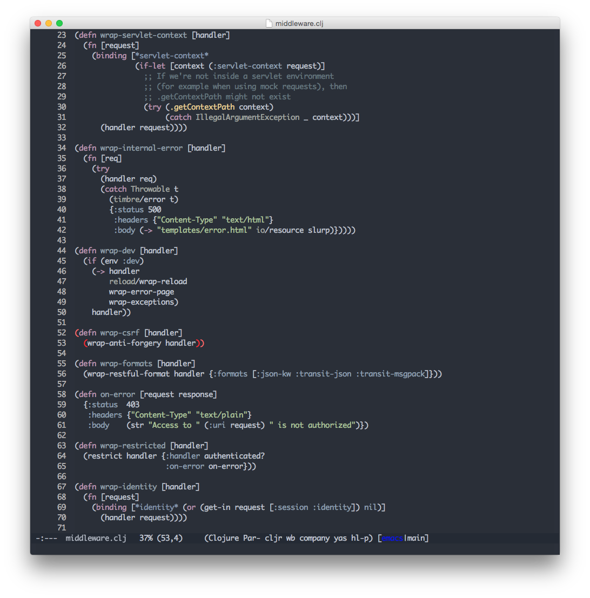

[](http://melpa.org/#/arjen-grey-theme)

## About

This is the arjen-grey theme. It is based on the
[space grey theme for xcode](https://github.com/zdne/spacegray-xcode).



## Installation

This package is part of the [melpa](http://melpa.org) archive. This
means you can run `M-x package-install RET arjen-grey-theme RET` and
the latest package will be installed.

If you are doing development on this package you will want to take the
file and `M-x eval-buffer` it for the immediate effect. If you want to
install it somewhat permenantly you can do the following:

`M-x package-install-file RET /path/to/checkout/arjen-grey.el RET`

In your init.el you can then load it using:

```lisp
(load-theme 'arjen-grey t)
```

## Status

This theme is currently very usable. I have been using it as my
default theme since I started building it.

The base theme was built using the 
[emacs theme editor](https://github.com/emacsfodder/emacs-theme-editor). I
used [hue code](http://huecode.com) to find some kick ass colors.

Happy coding!

Arjen
